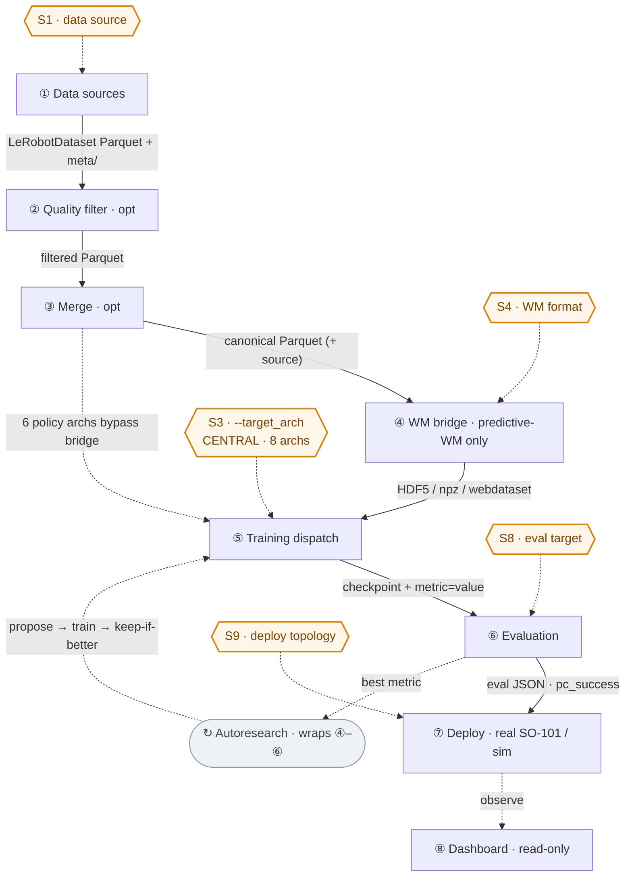

# lerobot-isaac-training

Modular training stack for the **SO-101 robot arm** combining Isaac Lab simulation,
LeRobot imitation-learning policies, and two world-model backends (DreamerV3 and
HF LeWorldModel) behind a single training entrypoint, with a metrics dashboard,
domain-randomization synthetic-data pipeline, and an autoresearch hyperparameter loop.

[](LICENSE)
[](https://www.python.org/)
[](https://pixi.sh)
[](https://github.com/astral-sh/ruff)
[](.pre-commit-config.yaml)

> **Status — research / scaffolding.** Phases 0 – 5 (workspace bootstrap, package
> wiring, dry-run smoke tests, documentation) are complete. Real training requires
> a GPU, Isaac Lab, and an SO-101 dataset. See [Build Status](#build-status).

---

## What's inside

**Thin-meta-repo architecture** (post-spinout, 2026-05-13): only
`lerobot-isaac-meta` lives in `packages/` as a live workspace member. The other
7 packages are public standalone GitHub repositories at `github.com/kvgork/<name>`.
See `docs/runbook/00-install.md`.

| Package | Source of truth | Role |
|---------|-----------------|------|
| [`lerobot-isaac-meta`](packages/lerobot-isaac-meta/) | live workspace | Umbrella CLI + workspace path resolver |
| `lerobot-isaac-env` | [github.com/kvgork/lerobot-isaac-env](https://github.com/kvgork/lerobot-isaac-env) | Isaac Lab `ManagerBasedRLEnv` for SO-101 (obs / actions / rewards / DR) |
| `lerobot-isaac-adapters` | [github.com/kvgork/lerobot-isaac-adapters](https://github.com/kvgork/lerobot-isaac-adapters) | Single `lerobot-isaac-train` entrypoint; dispatches by `--target_arch` |
| `lerobot-isaac-autoresearch` | [github.com/kvgork/lerobot-isaac-autoresearch](https://github.com/kvgork/lerobot-isaac-autoresearch) | `program.md` configs + wrapper for the autoresearch HP-search loop |
| `lerobot-isaac-synthetic` | [github.com/kvgork/lerobot-isaac-synthetic](https://github.com/kvgork/lerobot-isaac-synthetic) | DR-replay synthetic-data pipeline + MimicGen bridge stub |
| `lerobot-isaac-configs` | [github.com/kvgork/lerobot-isaac-configs](https://github.com/kvgork/lerobot-isaac-configs) | Shared YAML configs per `target_arch` |
| `robot-data-recorder` | [github.com/kvgork/robot-data-recorder](https://github.com/kvgork/robot-data-recorder) | RealSense D435 + SO-101 teleop dual-write recorder (standalone — not a meta dep) |
| `lerobot-isaac-dashboard` | [github.com/kvgork/lerobot-isaac-dashboard](https://github.com/kvgork/lerobot-isaac-dashboard) | Streamlit + Plotly metrics dashboard with snapshot + N-way compare |

Three training backends, one CLI:

```bash
lerobot-isaac-train --target_arch smolvla     ...   # imitation policy
lerobot-isaac-train --target_arch dreamerv3   ...   # world model (sheeprl)
lerobot-isaac-train --target_arch le_world_model ... # world model (HF LeWorldModel)
```

---

## Quickstart

### 1. Clone

```bash
git clone https://github.com/kvgork/lerobot-isaac-training.git
cd lerobot-isaac-training
```

### 2. Install dependencies

The recommended path runs `scripts/setup.sh`, which clones the 6 sibling repos
from GitHub into `src/<name>/` (using an optional local mirror if present, then
falling back to `https://github.com/kvgork/<name>.git`), then runs `pixi install`
with the `default` env (editable path deps from `src/`).

```bash
curl -fsSL https://pixi.sh/install.sh | bash    # one-time pixi install
bash scripts/setup.sh                           # clone siblings + pixi install
```

#### Frozen / reproducible install (no `src/` clones needed)

For CI or environments where you want siblings pulled directly from GitHub without
a local editable checkout:

```bash
pixi install -e frozen          # siblings installed from git+https://github.com/kvgork/...
```

#### Editable dev mode (default after `setup.sh`)

Want to edit a sibling package and see changes reflected without reinstalling?
The `default` env installs the 6 siblings as editable path deps from `src/`:

```bash
bash scripts/setup.sh           # clone siblings + pixi install (idempotent)
pixi run -e default test        # tests run against the editable clones

# Later: pull updates from GitHub into the local clones
pixi run sync-update            # git fetch && git pull --ff-only on each src/lerobot-isaac-*
```

#### Standalone install (no monorepo, no pixi)

```bash
pip install "packages/lerobot-isaac-meta[post-spinout]"
# pulls the 6 siblings from git+https://github.com/kvgork/<name>.git@main
```

The default `pixi install` activates `scripts/setup_env.sh`, which exports
`LEROBOT_ISAAC_WORKSPACE`, `CLAUDE_CODE_ROOT`, and `LEROBOT_CLAUDE_CODE_ROOT`
automatically inside the pixi environment.

Other environments (see `pixi.toml`):

| env | purpose |
|------|---------|
| `default` | dev tooling, lint, unit tests (siblings via editable path deps from `src/`) |
| `frozen` | reproducible install (siblings via `git+https://github.com/kvgork/...`) |
| `editable` | alias for default — retained for backwards compat |
| `train-policy` | LeRobot policy training (SmolVLA / ACT / Diffusion) |
| `train-dreamer` | DreamerV3 world-model training |
| `train-lewm` | HF LeWorldModel training |
| `sim` | Isaac Lab simulation (post `install-isaac-lab`) |
| `record` | SO-101 + D435 teleoperation recorder |
| `dashboard` | metrics dashboard (Streamlit + Plotly) |
| `full` | all features simultaneously |

```bash
pixi shell -e train-policy
```

### 3. Smoke test (no GPU required)

```bash
pixi run test                          # unit tests across all packages
pixi run lint && pixi run fmt          # ruff
lerobot-isaac-train --target_arch smolvla \
    --config packages/lerobot-isaac-configs/configs/policy_smolvla.yaml \
    --dry_run                          # verifies dispatch chain end-to-end
```

### 4. Optional — install Isaac Lab and download the SO-101 USD asset (GPU required)

```bash
pixi run install-isaac-lab             # ≈ 30 min, requires NVIDIA GPU + driver ≥ 535
pixi run download-usd                  # converts SO-101 URDF → USD via Isaac Lab
```

### 5. Optional — start the metrics dashboard

```bash
pixi run -e dashboard dashboard        # http://localhost:8501
```

---

## How it fits together

```
                                ┌─────────────────────────┐
   ┌──────────────┐    Parquet  │  robot-data-recorder    │
   │   SO-101 +   │────────────▶│  (D435 + teleop)        │
   │   D435 cam   │             └────────────┬────────────┘
   └──────────────┘                          │
                                             ▼  datasets/
                ┌────────────────────────────────────────────────┐
                │           datasets/<task>/<repo_id>/           │
                └─────────────┬───────────────────┬──────────────┘
                              │                   │
                              ▼                   ▼
              ┌─────────────────────┐   ┌───────────────────────┐
              │ lerobot-isaac-      │   │ lerobot-isaac-        │
              │ synthetic           │   │ adapters              │
              │ (DR replay +        │──▶│ (train.py dispatch    │
              │  MimicGen bridge)   │   │  by --target_arch)    │
              └─────────────────────┘   └──────────┬────────────┘
                                                   │
                          ┌──────────────┬─────────┴─────────┬──────────────┐
                          ▼              ▼                   ▼              ▼
                    ┌─────────┐   ┌─────────────┐   ┌──────────────┐   ┌──────────┐
                    │ SmolVLA │   │ DreamerV3   │   │ LeWorldModel │   │ ACT /    │
                    │  / ACT  │   │  (sheeprl)  │   │   (HF)       │   │ Diffusion│
                    └────┬────┘   └──────┬──────┘   └──────┬───────┘   └─────┬────┘
                         │               │                 │                 │
                         └───────────────┴────────┬────────┴─────────────────┘
                                                  ▼
                                       outputs/checkpoints/
                                       outputs/eval/
                                                  │
                                                  ▼
                                ┌──────────────────────────────────┐
                                │ lerobot-isaac-dashboard          │
                                │ (live UI + static report +       │
                                │  snapshots + N-way compare)      │
                                └──────────────────────────────────┘
```

The autoresearch loop (`lerobot-isaac-autoresearch`) wraps `lerobot-isaac-train`
to run mutation-driven hyperparameter search over any of the eight backends.

### Interchangeable components

The pipeline is a **fixed data spine** with **swappable slots** plugged into it.
Swaps are safe because the glue is a handful of stable data contracts
(LeRobotDataset Parquet · HDF5/npz/webdataset · checkpoint dir · `metric=value`
stdout line · eval JSON). Amber = swappable; the rest is the fixed pipe.



All 13 swappable slots:

| # | Slot | Selector | Options |
|---|------|----------|---------|
| S1 | Data source | ingestion tool run (no single flag) | real teleop · Isaac DR replay · MimicGen \* · sim demo-gen (13-dim, not merge-compatible) |
| S2 | Image storage dtype | `meta/info.json` feature dtype | `video` (MP4, legacy) · `image` (PNG inline, current) |
| S3 | **Training backend** `--target_arch` | argparse `_ALL_ARCHS` (3-way manual sync) | **Policy** `smolvla`·`act`·`diffusion` → `pc_success ↑` · **WM-policy** `vla_jepa`·`fastwam`·`lingbot_va` → `pc_success ↑` · **Predictive-WM** `dreamerv3` → `recon_loss ↓` · `le_world_model` \* → `pred_loss ↓` |
| S4 | WM bridge output format | `lerobot_to_worldmodel(output_format=)` | `hdf5` · `npz` (V-JEPA) · `webdataset` (Cosmos/GAIA) |
| S5 | WM image-size preset | `image_size=(H,W)` | 64² (default) · 96² · 128²/256² |
| S6 | `le_world_model` sub-backend | `LEROBOT_ISAAC_LEWM_BACKEND` | `_lewm_minimal` (default) · `hf` \* |
| S7 | Policy training wrapper | `--cache_frames` / `--use_lora` | bare `lerobot-train` · `cli_train_cached` (~7× throughput / LoRA) |
| S8 | Eval mode / deploy target | which eval entrypoint | open-loop MSE (default) · closed-loop real arm · closed-loop Isaac sim |
| S9 | Deploy topology | runbook-12 path | hybrid desktop+laptop · single-system |
| S10 | Autoresearch program | `program.md` path | `lerobot-policy` · `dreamerv3` · `leworldmodel` · `lerobot-policy-short` |
| S11 | Mutation operator | proposer picks 1/experiment | `tweak_lr` · `tweak_batch` · `tweak_steps` · `tweak_arch_param` · `tweak_data_aug` · `random_restart` |
| S12 | Pixi environment | `pixi run -e <env>` | `default` · `frozen` · `train-policy` · `train-dreamer` · `train-lewm` · `sim` · `dashboard` · `full` |
| S13 | Sibling source mode | env feature (mutually exclusive) | editable path deps from `src/` (dev) · `git+https` (frozen/repro) |

\* MimicGen is **deferred** (`LEROBOT_MIMICGEN_ENABLED=1`; raises `NotImplementedError`);
the `le_world_model` HF backend is **upstream-blocked** (`lerobot.scripts.train_world_model`
is not shipped) and falls back to the in-process `_lewm_minimal` stub.

See [`ARCHITECTURE.md`](ARCHITECTURE.md) for the full diagram, coupling rules,
and spinout mechanics.

---

## Documentation

| Want to … | Read |
|-----------|------|
| **Get the full pipeline picture in one doc** | [**`docs/pipeline-overview.md`**](docs/pipeline-overview.md) |
| Run everything end-to-end with one command | [`scripts/run_full_pipeline.sh`](scripts/run_full_pipeline.sh) (or `pixi run pipeline`) |
| **Deploy a trained policy on the real SO-101** | [**`docs/runbook/10-deploy-to-hardware.md`**](docs/runbook/10-deploy-to-hardware.md) |
| Get started for the first time | [`docs/runbook/01-bootstrap.md`](docs/runbook/01-bootstrap.md) |
| Collect SO-101 teleop data | [`docs/runbook/02-collect-data.md`](docs/runbook/02-collect-data.md) |
| Train a policy | [`docs/runbook/03-train-policy.md`](docs/runbook/03-train-policy.md) |
| Train a world model | [`docs/runbook/04-train-world-model.md`](docs/runbook/04-train-world-model.md) |
| Generate synthetic data | [`docs/runbook/05-augment-with-dr.md`](docs/runbook/05-augment-with-dr.md) |
| Run autoresearch | [`docs/internals/autoresearch-integration.md`](docs/internals/autoresearch-integration.md) + [`USAGE.md`](USAGE.md) §F |
| View metrics / compare runs | [`docs/runbook/07-dashboard.md`](docs/runbook/07-dashboard.md) |
| Batch train multiple archs + auto-compare | [`docs/runbook/08-batch-train-and-compare.md`](docs/runbook/08-batch-train-and-compare.md) |
| Understand the architecture | [`ARCHITECTURE.md`](ARCHITECTURE.md) |
| Browse the public Python API | [`docs/api-reference.md`](docs/api-reference.md) |
| Contribute code | [`CONTRIBUTING.md`](CONTRIBUTING.md) |

The full reference layout:

- `README.md` — this file (overview, quickstart, package map)
- `ARCHITECTURE.md` — diagrams, data flow, coupling rules, glossary
- `USAGE.md` — every workflow with exact commands; CLI reference; common errors
- `CONTRIBUTING.md` — pre-commit, code style, PR flow, testing
- `CHANGELOG.md` — release history
- `docs/runbook/` — step-by-step task guides
- `docs/internals/` — implementation deep-dives
- `docs/concepts/` — design rationale (modular adapter, soft imports, monorepo, pixi)
- `docs/research/` — library reference notes (Isaac Lab, DreamerV3, LeWorldModel, MimicGen)
- `docs/adr/` — Architecture Decision Records
- `packages/<pkg>/CLAUDE.md` — per-package orientation

---

## Build Status

| Phase | Description | Status |
|-------|-------------|--------|
| 0 | Workspace bootstrap (skeleton, packages, configs, .gitignore) | Done |
| 1 | Isaac Lab SO-101 env wired (soft-import; cfg construction green; camera obs deferred) | Done |
| 2 | Modular training adapter (subprocess + metric extraction; dry-run smoke green) | Done |
| 3 | Autoresearch e2e dry-run (`train_wrapper → train → metric` chain) | Done |
| 4a | Isaac DR replay + parquet writer + merge utilities | Done |
| 4b | MimicGen bridge path | Deferred (gated by `LEROBOT_MIMICGEN_ENABLED=1`) |
| 5 | Documentation polish | Done |
| A | Metrics dashboard (live UI + static report + snapshots + compare; 281 tests) | Done |
| — | Real-data smoke against actual SO-101 teleop dataset | Pending data |
| — | Camera observation wiring (`wrist_camera_rgb` / `overhead_camera_rgb`) | Pending CameraCfg in scene |
| — | Insertion task (`tasks/insertion.py` Stage 5 stub) | Pending |

---

## External dependencies

This workspace expects two adjacent repositories at runtime; both are auto-detected
or overridable via env var (set up by `scripts/setup_env.sh` / pixi activation):

| Variable | Default search order | What it points to |
|----------|---------------------|-------------------|
| `CLAUDE_CODE_ROOT` | `LEROBOT_CLAUDE_CODE_ROOT` → `~/tools/claude_code` → sibling dir | `claude_code` repo (agents + skills) |
| `LEROBOT_ISAAC_WORKSPACE` | this repo root (auto) | this workspace root |
| `VAULT_ROOT` | `~/Documents/Vaults/Local` if present | optional Obsidian vault for cross-references |

Workspace agents and skills (referenced from this repo's docs) live in the
[`claude_code`](https://github.com/anthropics/claude-code) repo and are **not**
duplicated here.

System-level prerequisites (handled by the install scripts in `scripts/`):

- **Isaac Sim** (NVIDIA Omniverse) — required for Isaac Lab
- **Isaac Lab** v2.1.0 — installed via `pixi run install-isaac-lab`
- **LeRobot** — installed via `pixi run install-lerobot` or `pip install lerobot[all]`
- **NVIDIA GPU** + driver ≥ 535 (RTX 3080 or better recommended)

See [`scripts/README.md`](scripts/README.md) for full execution order.

---

## License

MIT — see [`LICENSE`](LICENSE).

## Contributing

Pull requests welcome — see [`CONTRIBUTING.md`](CONTRIBUTING.md).
